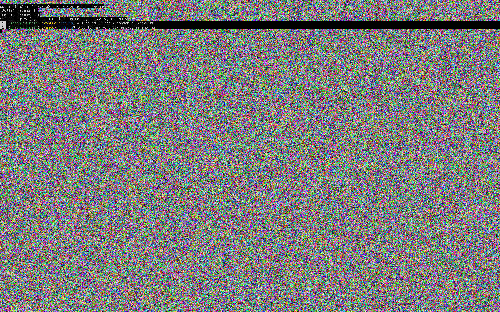

# Frame buffer device

To test it right away run this:
```sh
sudo dd if=/dev/urandom of=/dev/fb0
```



Video List:
 - https://www.youtube.com/watch?v=wjAJmqwg47k
 - https://archive.fosdem.org/2020/schedule/event/fbdev/
 - https://www.youtube.com/watch?v=haes4_Xnc5Q

Reading List:
 - https://www.kernel.org/doc/html/v7.2/fb/index.html
 - https://tldp.meulie.net/en/Framebuffer-HOWTO/Framebuffer-HOWTO.pdf
 - https://web.archive.org/web/20051129084903/http://dri.freedesktop.org/~jonsmirl/graphics.html

Sources:
 - http://www.paulbourke.net/dataformats/tga/
